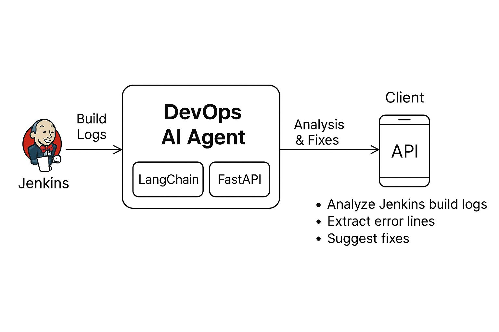

# DevOps AI Agent

This project provides an AI-powered API for analyzing Jenkins build logs and suggesting fixes using FastAPI and LangChain.



## Features
- Analyze Jenkins build logs and suggest fixes
- Extract error lines and summarize logs
- Explain CI/CD YAML files
- Identify Terraform issues
- Generate GitHub PR text
- Support for OpenAI GPT-4 and Ollama models
- Easy-to-use REST API
- Containerized with Docker for easy deployment


## Requirements
- Docker & Docker Compose (recommended)
- Or: Python 3.11+
- A `.env` file with the following variables:
  - `OPENAI_API_KEY` (for OpenAI GPT-4, optional if only using Ollama)
  - `OLLAMA_BASE_URL` (for Ollama, optional if only using OpenAI)

Example `.env`:
```env
OPENAI_API_KEY=your-openai-key
OLLAMA_BASE_URL=https://ollama.cloudaideveloper.com
```

## Quick Start (Docker Compose)


1. **Create a `.env` file** in the project directory (see above).
2. **Build and run the service:**
   ```bash
   docker-compose up --build
   ```
3. The API will be available at: [http://localhost:8000/analyze/](http://localhost:8000/analyze/)

## API Usage

- **POST** `/analyze/`
  - Upload a Jenkins build log file as form-data with the key `log`.
  - Returns a JSON response with analysis and suggested fixes.

Example using `curl`:
```bash
curl -X POST "http://localhost:8000/analyze/" -F "log=@/path/to/jenkins.log"
```

## Development (without Docker)

1. Install dependencies:
   ```bash
   pip install -r requirements.txt
   ```
2. Run the app:
   ```bash
   uvicorn main:app --reload
   ```

## File Structure
- `main.py` - FastAPI app and agent logic
- `tools.py` - Custom LangChain tools for log analysis
- `requirements.txt` - Python dependencies
- `Dockerfile` & `docker-compose.yml` - Containerization setup

## License
MIT
